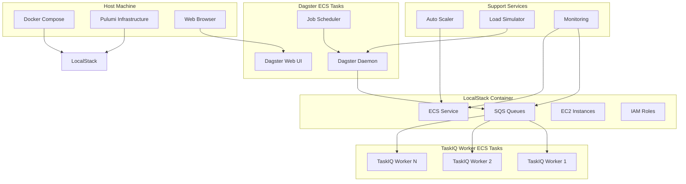

# Design Document

## Overview

This system demonstrates a production-like AWS deployment of Dagster with TaskIQ execution in a local environment using LocalStack. The architecture implements distributed job execution, auto-scaling, failure recovery, and exactly-once execution semantics through a combination of containerized services, message queuing, and infrastructure automation.

The design follows cloud-native patterns while running entirely locally, providing a realistic testing and development environment for distributed data processing workflows.

## Architecture

### High-Level Architecture



### Component Interaction Flow


## Components and Interfaces

### TaskIQ Executor Implementation

**Purpose**: Custom Dagster executor that distributes op execution across TaskIQ workers via SQS.

**Key Interfaces**:
- `DagsterTaskIQExecutor`: Main executor class implementing Dagster's executor interface
- `TaskIQOpTask`: Serializable task representation for remote execution
- `SQSBroker`: TaskIQ broker implementation for LocalStack SQS
- `IdempotencyManager`: Ensures exactly-once execution semantics

**Implementation Details**:
```python
class DagsterTaskIQExecutor(Executor):
    def __init__(self, sqs_endpoint: str, queue_name: str):
        self.broker = SQSBroker(sqs_endpoint, queue_name)
        self.idempotency_manager = IdempotencyManager()
    
    def execute(self, plan_context, execution_plan):
        # Serialize ops and enqueue with idempotency keys
        # Handle execution coordination and result collection
```

### Auto Scaling Service

**Purpose**: Monitors queue depth and scales TaskIQ workers in ECS based on load.

**Scaling Logic**:
- Scale up: Queue depth > (current_workers * 5) messages
- Scale down: Queue depth < (current_workers * 2) messages
- Min workers: 2, Max workers: 20
- Cooldown period: 60 seconds between scaling actions

**Failure Simulation**:
- Random worker termination (simulating EC2 spot interruptions)
- Scheduled drains during "deployment" windows
- Network partition simulation through security group modifications

### Load Simulator

**Purpose**: Generates configurable job patterns and simulates various failure scenarios for testing.

**Test Scenarios**:
1. **Steady Load**: Consistent job submission every 10 minutes
2. **Burst Load**: Periodic spikes with 5x normal job volume
3. **Mixed Workload**: Combination of fast (20±10s) and slow (5±2min) jobs
4. **Failure Recovery**: Worker failures during job execution
5. **Network Partitions**: Temporary SQS connectivity issues

### Infrastructure Components

**LocalStack Services**:
- SQS: Message queuing with FIFO queues for ordering and deduplication
- ECS: Container orchestration for Dagster and TaskIQ services
- EC2: Virtual instances for ECS tasks
- IAM: Role-based access control for service authentication
- CloudWatch: Metrics and logging (simulated)

**Pulumi Resources**:
```python
# SQS Queue with deduplication
task_queue = aws.sqs.Queue("dagster-taskiq-queue",
    fifo_queue=True,
    content_based_deduplication=True,
    visibility_timeout_seconds=900)

# ECS Cluster and Services
cluster = aws.ecs.Cluster("dagster-cluster")
dagster_service = aws.ecs.Service("dagster-daemon", ...)
taskiq_service = aws.ecs.Service("taskiq-workers", ...)
```

## Data Models

### Task Serialization

**OpExecutionTask**:
```python
@dataclass
class OpExecutionTask:
    op_name: str
    run_id: str
    step_key: str
    execution_context: Dict[str, Any]
    idempotency_key: str
    retry_count: int = 0
    max_retries: int = 3
```

**ExecutionResult**:
```python
@dataclass
class ExecutionResult:
    success: bool
    output_data: Optional[Dict[str, Any]]
    error_message: Optional[str]
    execution_time: float
    worker_id: str
```

### State Management

**IdempotencyRecord**:
- Stored in DynamoDB (LocalStack)
- Key: `{run_id}#{step_key}`
- Status: PENDING, RUNNING, COMPLETED, FAILED
- TTL: 24 hours for cleanup

## Error Handling

### Failure Scenarios and Recovery

1. **Worker Crashes During Execution**:
   - SQS message visibility timeout triggers redelivery
   - New worker checks idempotency record before re-execution
   - If status is RUNNING > timeout threshold, mark as FAILED and retry

2. **SQS Connection Failures**:
   - Exponential backoff with jitter (1s, 2s, 4s, 8s, 16s)
   - Circuit breaker pattern after 5 consecutive failures
   - Fallback to local execution for critical ops

3. **Dagster Daemon Failures**:
   - ECS health checks and automatic restart
   - Persistent storage for run state in LocalStack RDS
   - Resume incomplete runs on restart

4. **Network Partitions**:
   - TaskIQ workers cache execution context locally
   - Graceful degradation with local result storage
   - Reconciliation process on connectivity restoration

### Monitoring and Alerting

**Key Metrics**:
- Queue depth and processing rate
- Worker utilization and failure rate
- Op execution latency (P50, P95, P99)
- Exactly-once violation detection

**Health Checks**:
- SQS connectivity and queue accessibility
- ECS task health and resource utilization
- Dagster daemon responsiveness
- End-to-end job execution validation

## Testing Strategy

### Unit Testing

**TaskIQ Executor Tests**:
- Op serialization and deserialization
- Idempotency key generation and validation
- Error handling and retry logic
- SQS broker integration

**Auto Scaler Tests**:
- Scaling decision logic with various queue depths
- ECS service update operations
- Failure detection and recovery procedures

### Integration Testing

**End-to-End Scenarios**:
1. **Happy Path**: Complete job execution with mixed op types
2. **Scale Up/Down**: Automatic scaling under varying loads
3. **Worker Failure Recovery**: Mid-execution worker termination
4. **Network Resilience**: Temporary SQS unavailability
5. **Exactly-Once Validation**: Duplicate message handling

**Load Testing Framework**:
```python
class LoadTestScenario:
    def __init__(self, job_rate: float, failure_rate: float, duration: int):
        self.job_rate = job_rate
        self.failure_rate = failure_rate
        self.duration = duration
    
    async def execute(self):
        # Generate jobs, inject failures, measure outcomes
```

### Performance Testing

**Benchmarks**:
- Throughput: Jobs per minute under steady load
- Latency: Time from job submission to completion
- Scalability: Performance degradation with increased load
- Recovery Time: System restoration after failures

**Test Data Collection**:
- Execution traces with timing information
- Resource utilization metrics (CPU, memory, network)
- Queue depth and processing rate over time
- Failure injection results and recovery times

### Validation Framework

**Exactly-Once Verification**:
- Unique execution tracking per op instance
- Duplicate detection through comprehensive logging
- State consistency checks across system restarts
- Audit trail for all task state transitions

The testing strategy ensures comprehensive validation of the system's reliability, performance, and correctness under various operational conditions while maintaining the exactly-once execution guarantee.