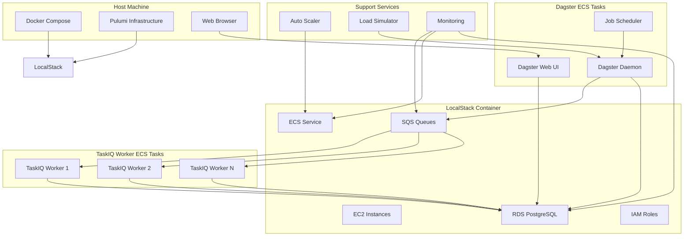
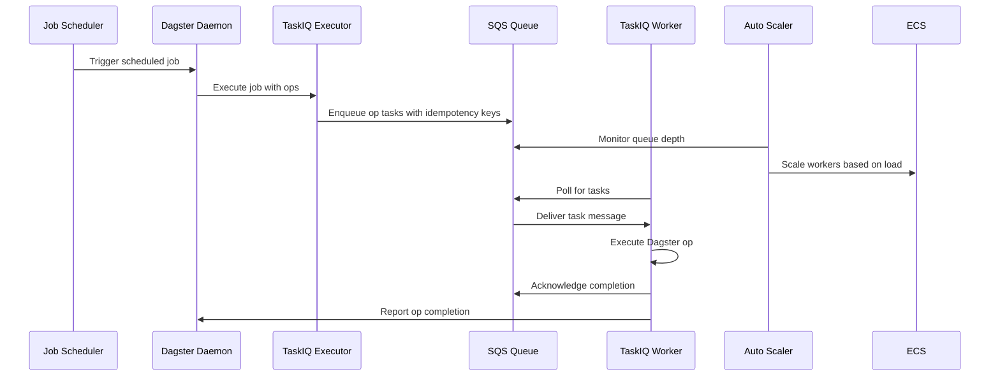

# Dagster TaskIQ LocalStack Demo

## Project Overview

This project demonstrates a production-like AWS deployment of Dagster with TaskIQ execution running locally using LocalStack. It showcases distributed job execution, auto-scaling, failure recovery, and exactly-once execution semantics.

## Architecture Components

### High-Level Architecture



### Component Interaction Flow



- **Dagster**: Orchestration platform with daemon and web UI
- **TaskIQ**: Distributed task execution framework
- **LocalStack**: Local AWS service emulation (SQS, ECS, EC2, RDS)
- **PostgreSQL**: Database backend for Dagster metadata and state
- **Auto-scaler**: Dynamic worker scaling based on queue depth
- **Load Simulator**: Testing framework for various load scenarios

## Key Features

### User Stories

- **As a developer**, I want to run a complete AWS-like Dagster deployment locally, so that I can test and demonstrate distributed job execution without cloud costs.
- **As a system administrator**, I want TaskIQ to use SQS as a message broker, so that job execution is decoupled and scalable.
- **As a data engineer**, I want Dagster jobs with variable execution times, so that I can test system behavior under different load conditions.
- **As a reliability engineer**, I want automatic scaling and failure recovery, so that the system maintains performance and reliability under varying loads.
- **As a data engineer**, I want exactly-once execution guarantees, so that no Dagster op executes more than once even during failures.
- **As a developer**, I want comprehensive end-to-end testing capabilities, so that I can validate system behavior under various load and failure conditions.
- **As a DevOps engineer**, I want infrastructure as code management, so that the LocalStack environment is reproducible and version-controlled.

### Implementation Highlights

- Implemented according to documentation in `.kiro/specs/dagster-taskiq-localstack/*.md`
    - Exactly-once execution guarantees
    - Automatic scaling based on queue depth
    - Failure simulation and recovery testing
    - Mixed workload support (fast/slow jobs)
    - Infrastructure as code with Pulumi
    - Comprehensive monitoring and metrics

## TaskIQ Implementation Notes

While the project is named "dagster-taskiq-executor" and uses TaskIQ-related terminology, the actual worker implementation does not use the TaskIQ framework directly. Instead, it implements a custom async worker using aioboto3 for SQS message consumption.

### Why Not Use the TaskIQ Framework?

The TaskIQ framework was evaluated but ultimately not used for the following reasons:

1. **Dagster Integration Complexity**: TaskIQ's task registration and execution model doesn't align well with Dagster's op/step execution lifecycle. Dagster ops require specific context reconstruction, resource management, and execution metadata that TaskIQ's generic task abstraction doesn't support.

2. **Idempotency Requirements**: The implementation requires exactly-once execution semantics with custom idempotency storage in PostgreSQL. TaskIQ's built-in retry mechanisms and state management are designed for simpler task queues and don't provide the granular control needed for Dagster's execution model.

3. **Custom Payload Handling**: Dagster ops need structured payloads (`OpExecutionTask`) with run/step metadata, execution context, and result reporting. TaskIQ's serialization and payload handling is too generic and would require extensive customization.

4. **Result Reporting**: The executor polls for task completion via idempotency storage rather than TaskIQ's result backend. This allows for better integration with Dagster's run monitoring and failure handling.

5. **Async Execution Control**: The worker needs fine-grained control over async execution, graceful shutdown, and health checks that TaskIQ's broker abstractions don't expose.

The custom implementation provides the necessary control and integration points while maintaining compatibility with TaskIQ's naming conventions and overall architecture patterns.

### Data Models

**OpExecutionTask**:
```python
@dataclass
class OpExecutionTask:
    op_name: str
    run_id: str
    step_key: str
    execution_context: Dict[str, Any]
    idempotency_key: str
    retry_count: int = 0
    max_retries: int = 3
```

**ExecutionResult**:
```python
@dataclass
class ExecutionResult:
    success: bool
    output_data: Optional[Dict[str, Any]]
    error_message: Optional[str]
    execution_time: float
    worker_id: str
```

### Error Handling

**Failure Scenarios and Recovery**:
1. **Worker Crashes During Execution**: SQS visibility timeout triggers redelivery; new worker checks idempotency record before re-execution.
2. **SQS Connection Failures**: Exponential backoff with jitter (1s, 2s, 4s, 8s, 16s); circuit breaker after 5 consecutive failures.
3. **Dagster Daemon Failures**: ECS health checks and automatic restart; persistent storage for run state in PostgreSQL.
4. **Network Partitions**: Workers cache execution context locally; reconciliation on connectivity restoration.

## Implementation Status

### ✅ Completed Components
- **Task Payloads & Idempotency**: JSON-serializable dataclasses with PostgreSQL persistence
- **SQS Broker**: Custom aioboto3-based broker (not using TaskIQ framework)
- **Basic Executor**: TaskIQExecutor with step dispatching and result polling
- **Worker Application**: Async SQS consumer with health checks and graceful shutdown
- **Container Integration**: ECS task definitions with worker commands and health probes
- **Repository Configuration**: TaskIQ executor set as default

### 🚧 In Progress / Next Steps
- **Actual Step Execution**: Worker currently simulates execution; needs real Dagster `execute_step` integration
- **Result Reporting**: Missing proper event reporting via `DagsterInstance.report_engine_event()`
- **Reliability Features**: Exponential backoff, visibility timeout handling, retry logic
- **API Compliance**: Executor uses internal `dagster._core` APIs instead of public ones
- **Testing**: Convert from unit tests to interface-level end-to-end tests

### 📋 Critical Path Forward
Complete core execution functionality in `.ai/plans/stage-01-02-completion.md` before proceeding to auto-scaling (Stage 03) and load simulation (Stage 04).

### Testing Strategy

**Unit Testing**: TaskIQ executor, auto-scaler decision logic, idempotency validation.

**Integration Testing**: End-to-end job execution flows, scale up/down scenarios, worker failure recovery, network resilience.

**Load Testing**: Configurable job patterns, failure injection, performance metrics collection.

**Validation Framework**: Exactly-once verification through execution tracking and audit trails.

## Development Setup

> [!IMPORTANT]
> Always run commands from a `zsh` shell so that `mise` automatically loads the configured tool versions. Launch `zsh` explicitly if your environment defaults to another shell.

The project uses:
- `uv` for Python package management
- `mise` (jdx/mise) for tool version management and task orchestration
- Docker Compose for LocalStack orchestration
- Pulumi for infrastructure provisioning

### Mise Tasks

This project uses `mise` to define common development tasks. All tasks support passing additional arguments to the underlying tools.

**Common Tasks:**
- `mise run install` - Install dependencies for app and deploy
- `mise run test` - Run tests for app and deploy
- `mise run lint` - Lint code (pass `--fix` to auto-fix)
- `mise run format` - Format code (pass `--check` to check only)
- `mise run typecheck` - Run type checkers
- `mise run check` - Run all checks (lint + typecheck + test)

**Passing Custom Arguments:**
```sh
mise run test -- -v -k "test_name"  # Pass pytest arguments
mise run lint -- --fix --select F  # Pass ruff arguments
mise run mypy -- --help             # Get mypy help
```

**Running Multiple Tasks:**
```sh
mise run format ::: lint ::: typecheck  # Run in parallel
```

## Project Structure

```
./
├── app/                    # Main Python application
│   ├── src/                # Pyton Dagster Application code
│   └-─ tests/              # App Test suite
├── deploy/                 # Pulumi infrastructure as code
└── docker-compose.yml      # LocalStack service
```

## Getting Started

### Initial Setup

1. Launch LocalStack:
   ```sh
   docker compose up -d localstack
   ```

2. Deploy the infrastructure with Pulumi:
   ```sh
   mise run up
   ```
   This creates the ECR repository and other AWS resources in LocalStack.

3. Build and push the application Docker image to LocalStack ECR:
   ```sh
   ./scripts/build-and-push.sh
   ```
   This script uses Docker Bake to build the application image and pushes it to LocalStack ECR using `awslocal`.

4. Run Dagster services as described in the application README once infrastructure is provisioned.

### Development Workflow

**Application code changes:**
1. Rebuild and push the image: `./scripts/build-and-push.sh`
2. Update ECS services to use the new image (Pulumi doesn't need to run again unless infrastructure changes)

**Infrastructure changes:**
1. Update Pulumi code
2. Run: `mise run up`

See individual component READMEs for detailed setup instructions.

### Stack Passphrases
- `local` stack: passphrase is `localstack` (for use with LocalStack development)
- `dev` stack: passphrase is managed separately

## Code Quality & Linting

```sh
# Run all checks across app and deploy
mise run check

# Or run individual components
cd app && mise run format && mise run lint --fix && mise run typecheck && mise run test
cd deploy && mise run format && mise run lint --fix && mise run typecheck && mise run test

# Pass custom arguments to tools
mise run format --check  # Check formatting without modifying files
mise run lint --fix      # Auto-fix linting issues
mise run test -v         # Run tests with verbose output
mise run mypy --help     # Get help for mypy

# Run multiple tasks in parallel
mise run format ::: lint ::: typecheck
```

## Python Guidance

- Follow best practices for DRY, YAGNI, and functional code for Python 3.13
- Ensure that ruff, mypy, pyright, and pytest all pass as described above after making changes
- For testing:
    - Use `pytest.mark.parametrize` to keep tests easy to maintain and follow the AAA pattern
    - Only test at the interface level (e.g. Dagster Job) and avoid writing low-level unit tests unless there is critical logic that can't be easily tested easily at the interface
    - Write the fewest tests that provide the most coverage

## Testing Guidance

- Validate Dagster behavior end-to-end: job wiring, schedules, configuration loading, and repository completeness.
- Avoid probing Dagster internals or private modules; skip trivial per-op tests unless business logic warrants it.
- Keep test configuration centralized (e.g., `.env.test` fixtures) and favor lightweight boundary mocks such as replacing `asyncio.sleep`.
- Stick to modern APIs like `execute_in_process()` and property accessors when asserting run results and definitions.
- Never structure pytest suites with unittest-style classes or `unittest.TestCase`; use plain functions and parametrization instead.

## Pulumi Guidance

- Follow above Python guidance and Pulumi best practices, additionally follow:
- Use Pulumi.yaml for configuration instead of ESC; share config via `StackSettings` in `deploy/config.py` with per-environment overrides in `Pulumi.<stack>.yaml`.
- Prepare for multiple environments/stacks, but focus on LocalStack deployment initially. Avoid hard-coding constants.
- Organize infrastructure with Four Factors: Templates (reusable code), Components (encapsulated resources), Environments (config via Pulumi.yaml), Policies (governance rules).
- Use patterns like composable environments, components using other components, and policies as tests for cost/security control.

### Infrastructure Organization: `components/` vs `modules/`

**`deploy/components/`** - Generic, reusable AWS primitives
- Technology-focused thin wrappers (VPC, ECS, RDS, SQS)
- Functions returning dataclasses, independently importable (no `__init__.py` re-exports)
- Examples: `sqs_fifo.py`, `ecs_helpers.py`, `rds_postgres.py`

**`deploy/modules/`** - Application-specific infrastructure bundles
- Compose multiple components with application logic
- Know about Dagster, TaskIQ, and other app concerns
- Examples: `dagster.py` (complete deployment), `taskiq.py` (queues + workers + IAM)

**Guideline**: Reusable across projects? → `components/`. Application-specific bundle? → `modules/`

---

Keep this file up to date as major changes are made or errors in implementation are corrected

## Collaboration & Git Workflow

- Assume a human operator is actively managing the git repository state in real time.
- They may stage, commit, or modify other files unrelated to your task; do not assume repository cleanliness.
- Avoid undoing or overwriting human changes—coordinate through explicit instructions if conflicts arise.

## Automation Notes

- **Pulumi runs locally**: No Docker container required for Pulumi - just run `mise run <pulumi-task>` (e.g., `mise run up`, `mise run preview`)
- **Docker Bake for builds**: Images are built using Docker Bake (see `docker-bake.hcl`) via `./scripts/build-and-push.sh`
- **Image Build Separation**: Docker images are built and pushed separately from Pulumi using `./scripts/build-and-push.sh` and the `awslocal` CLI. This avoids networking complexity and uses LocalStack's well-tested workflow.
- When validating changes, run `mise run preview`
- If Pulumi doesn't stop and is running for more than 10 minutes, that likely means there was a failure and the logs from Docker Compose LocalStack need to be inspected. Do not let Pulumi run for more than 10 minutes. If Pulumi is stopped (Ctrl-C twice), then a human must run `cd deploy && pulumi cancel` and reconfirm the stack name to release the lock
- Pulumi commands must include `--yes` for automated deployments so the CLI never waits for manual confirmation.

## Container Image Management

The project uses Docker Bake to simplify container image builds and separates building from infrastructure provisioning:

- **Build Tool**: Docker Bake (config in `docker-bake.hcl`) provides declarative, reproducible builds
- **Build & Push**: Use `./scripts/build-and-push.sh` to build with Bake and push to LocalStack ECR
- **Pulumi**: Only creates the ECR repository and references the pre-built image
- **Why**: This approach avoids networking complexity with Pulumi's docker-build provider and LocalStack ECR, using the well-documented `awslocal` workflow instead

Prerequisites:
- LocalStack running (`docker compose up -d localstack`)
- `awslocal` installed (`uvx awscli-local` or `mise use pipx:awscli-local`)
- `uv` for Python dependency management
- `pulumi` CLI installed locally (or via `mise`)
